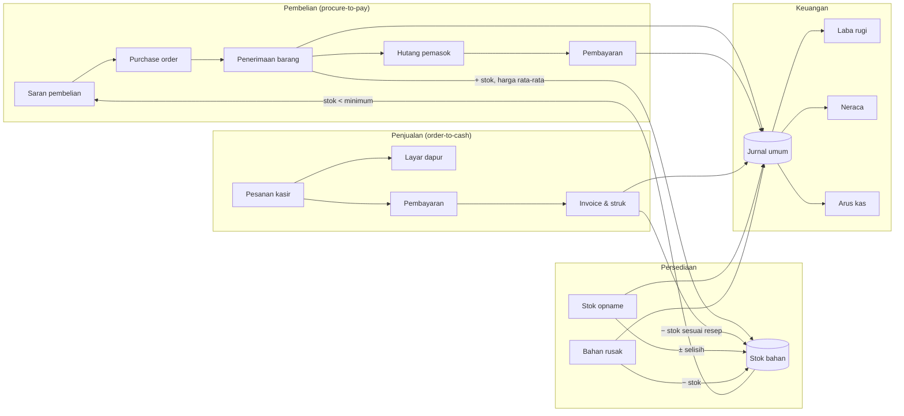
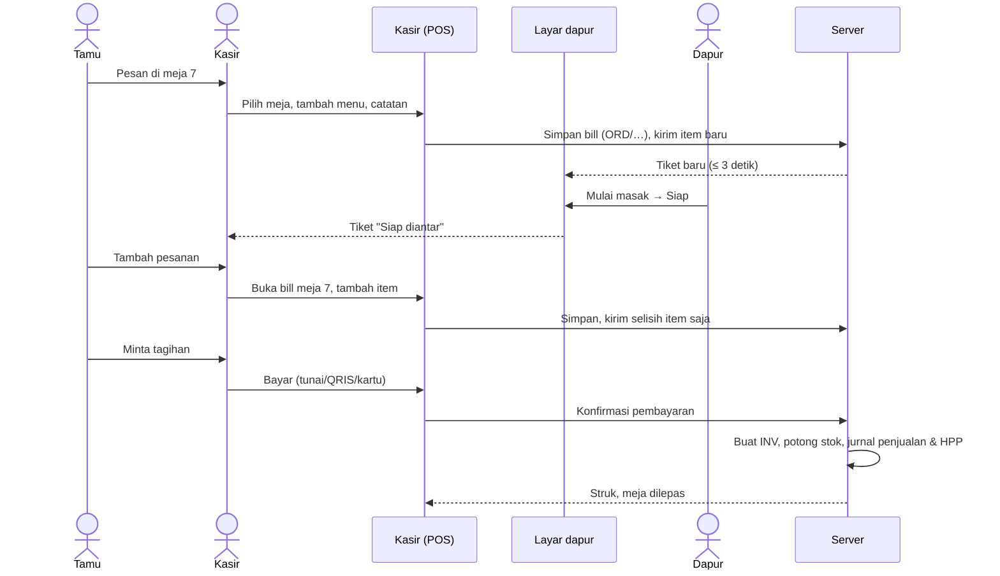
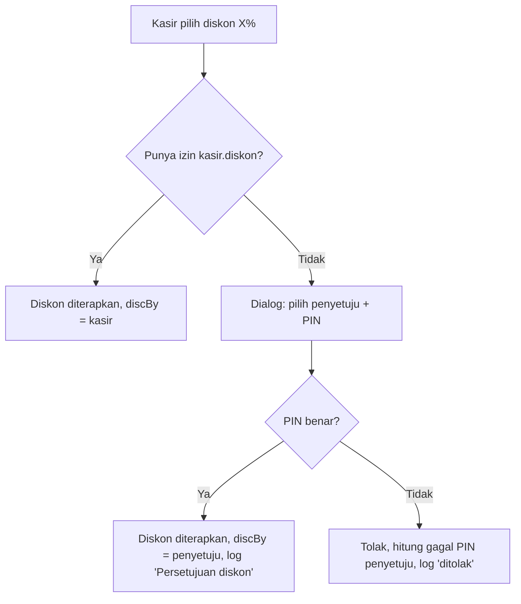
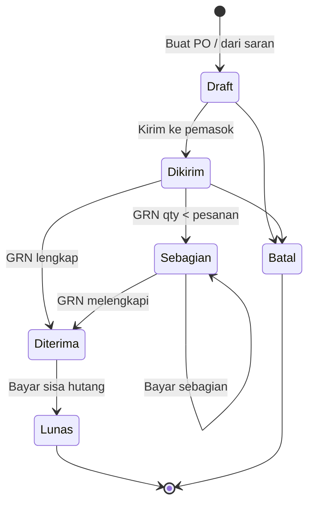
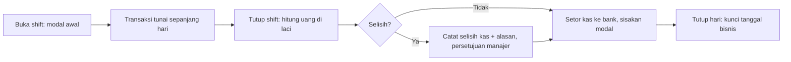

# 04 · Alur Bisnis

Diagram memakai Mermaid dan tampil langsung di GitHub. Setiap alur menyebut dokumen yang dihasilkan, efek ke stok, dan jurnal (rinciannya di [05](05-aturan-akuntansi.md#58-jurnal-otomatis)).

## 4.1 Peta proses



## 4.2 Pesanan dine-in sampai bayar



**Aturan:**

- Bill terbuka **tidak** memotong stok. Stok dipotong saat pembayaran dikonfirmasi, supaya bill yang batal tidak membuat selisih.
- Kartu menu di kasir menghitung porsi tersedia dari stok dikurangi qty yang sudah ada di keranjang aktif. Di versi produksi, qty di bill terbuka lain juga dikurangi sebagai *reserved* (lihat [12 · Keputusan terbuka](12-glosarium.md#122-keputusan-terbuka), K-03).
- Item yang sudah dikirim ke dapur hanya bisa dibatalkan lewat void item dengan persetujuan. Bahan yang sudah dimasak dicatat sebagai waste.

## 4.3 Take away & online

1. Kasir memilih tipe **Take away** (nama pelanggan opsional) atau **Online** (no. order mitra, mis. `GF-882910`).
2. Service charge tidak dikenakan, kecuali pengaturan mengizinkannya untuk take away.
3. Pesanan online dibayar dengan metode **GoFood/GrabFood** dan masuk ke akun Bank sebagai piutang settlement (versi 1.0 langsung ke Bank; lihat K-05).
4. Setelah bayar, tiket langsung dikirim ke dapur bila belum dikirim.

## 4.4 Persetujuan diskon



## 4.5 Pembelian sampai bayar



**Langkah dan efek:**

| Langkah | Pelaku | Dokumen | Efek stok | Jurnal |
|---|---|---|---|---|
| Saran pembelian | Sistem | — | — | — |
| Buat & kirim PO | Gudang | `PO/YYMM/NNN` | — | — |
| Terima barang | Gudang | `GRN/YYMM/NNN` | + qty × isi satuan beli; harga rata-rata diperbarui | Persediaan (D) / Hutang usaha (K) |
| Bayar pemasok | Akuntan | `BKK/YYMM/NNN` | — | Hutang usaha (D) / Kas atau Bank (K) |

Jatuh tempo dihitung sejak **tanggal penerimaan pertama** ditambah termin pemasok. Bila ada penerimaan susulan, jatuh tempo diperbarui ke penerimaan terakhir (perilaku purwarupa; lihat K-06).

## 4.6 Saran pembelian

```
untuk setiap bahan dengan stok < stok_minimum:
    dalam_po   = Σ (qty_pesan − qty_diterima) × isi_satuan_beli  pada PO berstatus Draft/Dikirim/Sebagian
    kebutuhan  = max(0, stok_target − stok − dalam_po)
    saran_beli = ceil(kebutuhan ÷ isi_satuan_beli)          // dalam satuan beli
    harga      = harga_beli_terakhir
kelompokkan per pemasok utama → satu tombol "Buat PO" per pemasok
```

Stok minimum dan target diisi manual per bahan. Nilai awal yang disarankan:

- stok minimum ≈ 2,5 hari pemakaian rata-rata;
- stok target ≈ 9 hari pemakaian rata-rata.

## 4.7 Stok opname

1. Petugas memulai opname; sistem mengambil **stok sistem** saat itu untuk setiap bahan.
2. Petugas mengisi **stok fisik**. Selisih dan nilai selisih dihitung langsung.
3. Saat diposting:
   - dokumen `SO/YYMM/NNN` dibuat;
   - stok sistem diganti dengan stok fisik;
   - kartu stok mendapat mutasi `opname`;
   - jurnal selisih terbentuk.
4. Transaksi penjualan yang terjadi antara mulai dan posting opname dicatat terpisah. Versi produksi wajib menghitung ulang: `stok_fisik_disesuaikan = stok_fisik − pemakaian sejak snapshot` (lihat K-07).

## 4.8 Bahan rusak (waste)

Kepala dapur atau gudang mencatat bahan, qty (satuan pakai), dan alasan. Stok berkurang dan nilainya dibebankan ke akun 5-102 Selisih Persediaan & Bahan Rusak. Qty tidak boleh melebihi stok sistem.

## 4.9 Kas harian & tutup hari



- **Setor kas ke bank** memindahkan saldo dari 1-101 ke 1-102. Transaksi ini tidak dihitung sebagai arus kas masuk atau keluar.
- **Setor PBJT** dilakukan paling lambat tanggal 10 bulan berikutnya, sesuai peraturan daerah (DKI Jakarta). Seluruh saldo 2-102 dibayar dari bank.
- **Tutup hari** (baru di versi produksi): setelah tanggal bisnis ditutup, transaksi pada tanggal itu tidak bisa diubah. Koreksi dilakukan dengan transaksi pembalik di tanggal berjalan.

## 4.10 Tutup bulan

1. Pastikan semua PO yang barangnya sudah datang sudah di-GRN.
2. Lakukan stok opname akhir bulan (semua bahan).
3. Catat semua biaya bulan berjalan (sewa, gaji, listrik, gas, pemasaran).
4. Cek neraca seimbang dan saldo persediaan sama dengan laporan persediaan.
5. Ekspor laba rugi, neraca, arus kas, dan laporan PBJT.
6. Kunci periode (baru di versi produksi): hanya Pemilik yang bisa membuka kembali, dan tindakan itu tercatat di log.
