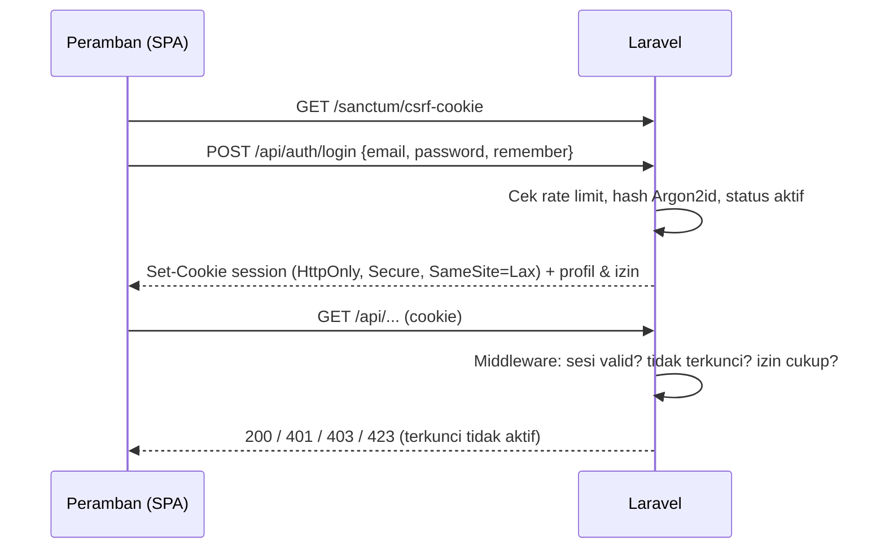
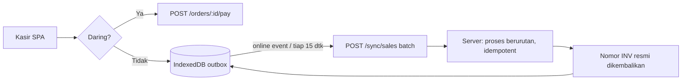

# 06 · Arsitektur Sistem

## 6.1 Prinsip

1. **Server adalah sumber kebenaran.** Perhitungan uang, stok, jurnal, penomoran, dan izin dijalankan di server. Klien hanya menampilkan data dan mengantre transaksi saat luring.
2. **Satu transaksi basis data per kejadian bisnis.** Pembayaran, GRN, opname, dan waste masing-masing menulis dokumen, mutasi stok, dan jurnal dalam **satu transaksi DB**: semuanya berhasil atau semuanya batal.
3. **Kasir tidak boleh berhenti karena internet putus.**
4. **Cocok dengan hosting yang sudah ada:** cPanel Domainesia (PHP, MySQL/MariaDB, Git deploy, cron, AutoSSL). Tidak membutuhkan server khusus pada versi 1.0.

## 6.2 Teknologi yang direkomendasikan

| Lapisan | Pilihan | Alasan |
|---|---|---|
| Backend | **Laravel 11** (PHP ≥ 8.2) | Berjalan di cPanel; migrasi, antrean, penjadwal, dan autentikasi siap pakai; subdomain lain di akun ini sudah memakai pola `…/public` |
| Basis data | **MySQL 8 / MariaDB ≥ 10.6** (InnoDB, utf8mb4) | Tersedia di hosting; mendukung transaksi & kunci baris |
| Autentikasi | Laravel **Sanctum** (sesi cookie untuk SPA, token untuk perangkat KDS/printer) | Sederhana, aman, tanpa token panjang di peramban |
| Frontend | **Vue 3 + Vite + Pinia**, sebagai SPA dan **PWA** | Mode luring kasir (service worker + IndexedDB); komponen purwarupa mudah dipindahkan |
| Desain | Token CSS KG SafeGuard dari `assets/style.css` purwarupa | Konsisten dengan aplikasi Semesta lain |
| Real-time dapur | *Polling* 3 detik dengan `ETag`/`since` (v1.0); opsional Pusher/Ably (v1.1) | Shared hosting tidak mendukung WebSocket jangka panjang |
| Antrean & jadwal | Laravel queue driver `database` + cron cPanel `schedule:run` tiap menit | Tanpa Redis |
| Pembayaran QRIS | Midtrans atau Xendit (QRIS dinamis + webhook) | Konfirmasi lunas otomatis |
| Cetak struk | ESC/POS lewat **QZ Tray** (PC kasir) atau **RawBT** (tablet Android); fallback `window.print()` 58/80 mm | Peramban tidak bisa mengirim perintah ESC/POS langsung |
| Email | SMTP cPanel | Atur ulang kata sandi, kirim PO |
| Pengujian | Pest (PHP), Vitest (unit JS), Playwright (E2E) | Playwright sudah dipakai untuk purwarupa |
| CI | GitHub Actions | Uji, build aset, lalu picu Git deploy cPanel |

## 6.3 Autentikasi



- Izin dibaca dari DB (dengan *cache* 60 detik per peran, dibersihkan saat matriks diubah). Izin tidak ditanam di token.
- PIN login memakai endpoint terpisah `POST /api/auth/pin` dengan rate limit per pengguna.
- Kunci layar: server menandai sesi `locked_at`. Semua endpoint mengembalikan `423 Locked` sampai `POST /api/auth/unlock` berhasil.
- Perangkat layar dapur memakai **token perangkat** dengan izin `m:dapur` saja, dan bisa dicabut dari Pengaturan.

## 6.4 Mode luring kasir



- **Data lokal yang di-cache** saat masuk dan setiap 5 menit: menu, resep ringkas, harga, meja, pengaturan pajak, dan stok bahan (untuk estimasi porsi).
- **Transaksi luring** diberi `client_uuid` (UUID v7) dan nomor sementara `OFF-<device>-<n>`. Struk mencetak nomor sementara dengan tanda "Luring".
- **Sinkronisasi idempoten:** server menolak `client_uuid` ganda dengan mengembalikan hasil yang sudah ada. Transaksi diproses sesuai urutan `created_at` klien, dan server membuat nomor INV resmi dengan tanggal bisnis transaksi.
- **Konflik stok:** transaksi luring **selalu diterima** walau stok server menjadi minus (penjualan sudah terjadi). Bahan minus ditandai merah dan muncul di dasbor untuk dicek lewat opname.
- **Pembatasan saat luring:** QRIS dinamis tidak tersedia (pakai QRIS statis + konfirmasi manajer); laporan dan modul non-kasir tidak tersedia.
- **Batas aman:** outbox maksimum 2.000 transaksi atau 48 jam. Setelah itu kasir diperingatkan untuk segera daring.

## 6.5 Komponen & modul backend

```
app/
  Domain/
    Auth/          login, PIN, kunci layar, rate limit, audit
    Access/        roles, permissions, policy per modul
    Catalog/       menu_categories, menu_items, recipes
    Sales/         orders (bill), order_items, sales, payments, kitchen_tickets, tables
    Purchasing/    suppliers, purchase_orders, goods_receipts, supplier_payments
    Inventory/     ingredients, stock_movements, stock_counts, wastes, valuation
    Finance/       accounts, journals, expenses, cash_transfers, tax_payments
    Reporting/     query read-only untuk laporan (tidak menulis)
    Settings/      outlet, taxes, devices, sequences
  Http/Controllers/Api/...   tipis: validasi → panggil service domain → resource JSON
```

**Layanan inti yang wajib diuji tuntas:**

| Service | Tanggung jawab |
|---|---|
| `BillCalculator` | Rumus 5.1, dipakai server dan disalin identik di klien (uji silang dengan contoh A/B) |
| `CheckoutService` | Validasi stok → buat sale & payment → potong stok per resep → jurnal → lepas meja → tiket dapur |
| `ReceivingService` | GRN → mutasi stok → harga rata-rata → hutang → jurnal |
| `InventoryValuation` | Harga rata-rata tertimbang (5.4) dan nilai mutasi |
| `JournalWriter` | Menyusun baris, validasi seimbang, pembulatan, simpan |
| `SequenceService` | Nomor dokumen atomik (`SELECT … FOR UPDATE`) |
| `SyncService` | Batch luring idempoten |

## 6.6 Integrasi pihak ketiga

| Integrasi | Arah | Keterangan |
|---|---|---|
| QRIS (Midtrans/Xendit) | Keluar + webhook masuk | Buat tagihan QRIS dengan `order_id = sale uuid`; webhook bertanda tangan menandai lunas; kadaluarsa 5 menit |
| Printer thermal | Lokal | QZ Tray (sertifikat ditandatangani) / RawBT intent; template struk 58 dan 80 mm |
| EDC | Manual | Input no. approval |
| Ojol (GoFood/GrabFood) | Manual v1.0 | Integrasi GoBiz/GrabMerchant API menunggu akses mitra |
| Email SMTP | Keluar | Atur ulang kata sandi, PO ke pemasok (PDF) |

## 6.7 Lingkungan & deployment

| Lingkungan | URL | Branch | Data |
|---|---|---|---|
| Lokal | `localhost` | fitur | Seeder demo |
| Staging | `staging-posfnb.semestateknologiutama.com` *(dibuat)* | `develop` | Seeder demo + salinan anonim |
| Produksi | `posfnb.semestateknologiutama.com` | `main` | Nyata |
| Purwarupa (sekarang) | `posfnb.semestateknologiutama.com` | `claude/charming-hamilton-04d6ma` | Data demo di peramban |

**Alur deploy:**

1. PR ke `develop` → CI menjalankan lint, Pest, Vitest, dan Playwright.
2. Merge ke `develop` → CI build `public/build` + `vendor` ke branch `deploy-staging` → Git deploy cPanel staging.
3. Tag rilis `vX.Y.Z` di `main` → build ke `deploy-prod` → Git deploy produksi → `php artisan migrate --force` lewat cron satu kali / hook deploy.

**Struktur di hosting:**

- kode di `/home/semestat/posfnb-app`;
- document root subdomain diarahkan ke `/home/semestat/posfnb-app/public`, seperti pola `lms-app/public` yang sudah ada;
- `.env` berada di luar Git dan diisi manual di server.

**Cron cPanel:**

```
* * * * * cd /home/semestat/posfnb-app && php artisan schedule:run >> /dev/null 2>&1
```

## 6.8 Kapasitas awal

| Ukuran | Asumsi per outlet | Keterangan |
|---|---|---|
| Transaksi | 100–300 / hari | ± 100 ribu / tahun |
| Baris item | 2,5 / transaksi | ± 250 ribu / tahun |
| Mutasi stok | ± 8 bahan / item | ± 2 juta / tahun → wajib indeks `(ingredient_id, occurred_at)` |
| Jurnal | 1 / transaksi + dokumen lain | ± 120 ribu / tahun |
| Pengguna bersamaan | ≤ 10 | Shared hosting cukup; pindah ke VPS bila > 5 outlet |
