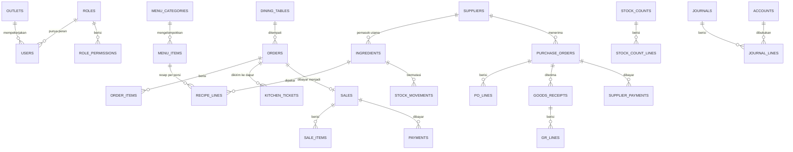

# 07 · Skema Basis Data

## 7.1 Konvensi

| Hal | Aturan |
|---|---|
| Mesin | InnoDB, `utf8mb4_unicode_ci` |
| Kunci utama | `id BIGINT UNSIGNED AUTO_INCREMENT`; tabel transaksi juga punya `uuid CHAR(36)` unik untuk sinkronisasi & URL |
| Uang | `BIGINT` Rupiah tanpa desimal (mis. `total`, `price`) |
| Kuantitas bahan | `DECIMAL(14,2)` dalam satuan pakai |
| Harga rata-rata per satuan pakai | `DECIMAL(16,4)` |
| Persen | `DECIMAL(5,2)` |
| Waktu | `TIMESTAMP` UTC; `business_date DATE` untuk tanggal bisnis outlet |
| Multi-outlet | Setiap tabel data usaha punya `outlet_id` (v1.0 selalu 1) |
| Hapus | Master data memakai `is_active`/`deleted_at` (soft delete); **dokumen transaksi tidak pernah dihapus**, hanya di-void/dibatalkan |
| Jejak | `created_by`, `updated_by` (FK `users.id`) pada semua dokumen |

## 7.2 Diagram relasi (inti)

## 7.3 Akses & sistem

### `outlets`
| Kolom | Tipe | Keterangan |
|---|---|---|
| id | BIGINT PK | |
| name, branch | VARCHAR(120) | "Dapur Nusantara", "Cabang Kemang" |
| address | VARCHAR(255) | |
| phone, npwp | VARCHAR(40) | |
| timezone | VARCHAR(40) | default `Asia/Jakarta` |
| business_day_cutoff | TIME | default `04:00:00` |
| tax_enabled | BOOLEAN | default 1 |
| tax_rate | DECIMAL(5,2) | default 10.00 |
| service_rate | DECIMAL(5,2) | default 5.00 |
| service_on_takeaway | BOOLEAN | default 0 |
| target_food_cost | DECIMAL(5,2) | default 35.00 |
| receipt_footer | VARCHAR(255) | |

### `roles`, `role_permissions`
| Tabel | Kolom |
|---|---|
| roles | id, outlet_id, code (`owner`,`manajer`,…) UNIQUE per outlet, name, description, tone, is_locked BOOLEAN |
| role_permissions | role_id FK, permission VARCHAR(40) (`m:kasir`, `kasir.bayar`, `*`), PK(role_id, permission) |

### `users`
| Kolom | Tipe | Keterangan |
|---|---|---|
| id, outlet_id | BIGINT | |
| name | VARCHAR(120) | |
| email | VARCHAR(160) UNIQUE | login |
| password | VARCHAR(255) | Argon2id |
| pin_hash | VARCHAR(255) NULL | Argon2id dari PIN 6 digit |
| role_id | FK roles | |
| is_active | BOOLEAN | |
| last_login_at | TIMESTAMP NULL | |
| two_factor_secret | TEXT NULL | v1.1 |

### `audit_logs` (tambah saja)
id, outlet_id, user_id NULL, event VARCHAR(60), detail TEXT, subject_type/subject_id (polimorfik, opsional), ip VARCHAR(45), user_agent VARCHAR(255), created_at. Indeks `(outlet_id, created_at)`, `(user_id, created_at)`.

### `login_attempts`
key VARCHAR(190) PK (`pw:email` / `pin:user_id`), attempts INT, locked_until TIMESTAMP NULL, updated_at. *(Boleh memakai `RateLimiter` Laravel berbasis cache database.)*

### `devices`
id, outlet_id, name, type ENUM(`kds`,`printer`,`edc`,`kasir`), token_hash, config JSON, last_seen_at, is_active.

### `sequences`
outlet_id, prefix VARCHAR(10), period VARCHAR(8) (`20260924` / `2609`), last_number INT, PK(outlet_id, prefix, period). Dikunci `FOR UPDATE` saat membuat nomor.

## 7.4 Menu & resep

### `menu_categories`
id, outlet_id, name, icon, sort_order, is_active.

### `menu_items`
| Kolom | Tipe | Keterangan |
|---|---|---|
| id, outlet_id | | |
| code | VARCHAR(20) | `MN01`, unik per outlet |
| category_id | FK | |
| name | VARCHAR(120) | |
| price | BIGINT | harga jual sebelum pajak |
| prep_minutes | SMALLINT | waktu saji |
| icon / image_path | VARCHAR | |
| serving_notes | TEXT | standar penyajian |
| steps | JSON | array langkah |
| is_active | BOOLEAN | tampil di kasir |

### `recipe_lines`
id, menu_item_id FK, ingredient_id FK, qty DECIMAL(14,2) (satuan pakai per 1 porsi), sort_order. UNIQUE(menu_item_id, ingredient_id).

### `menu_price_history`
id, menu_item_id, old_price, new_price, changed_by, changed_at. *(Perubahan resep dicatat di `audit_logs` dengan detail JSON sebelum/sesudah.)*

## 7.5 Penjualan

### `dining_tables`
id, outlet_id, number SMALLINT, area VARCHAR(40), seats SMALLINT, is_active.

### `reservations`
id, table_id, guest_name, reserved_at DATETIME, pax SMALLINT, status ENUM(`booked`,`arrived`,`cancelled`,`no_show`), notes.

### `orders` (bill terbuka)
| Kolom | Tipe | Keterangan |
|---|---|---|
| id, uuid, outlet_id | | |
| number | VARCHAR(24) | `ORD/20260924/0006` |
| business_date | DATE | |
| type | ENUM(`dinein`,`takeaway`,`online`) | |
| table_id | FK NULL | wajib bila dine-in |
| customer_name | VARCHAR(120) | / no. order ojol |
| discount_pct | DECIMAL(5,2) | |
| discount_approved_by | FK users NULL | |
| status | ENUM(`open`,`paid`,`cancelled`) | |
| opened_by, opened_at, closed_at | | |

### `order_items`
id, order_id, menu_item_id, qty SMALLINT, note VARCHAR(160), sent_qty SMALLINT (sudah dikirim ke dapur), unit_price BIGINT (snapshot saat ditambah).

### `kitchen_tickets`, `kitchen_ticket_items`
| Tabel | Kolom |
|---|---|
| kitchen_tickets | id, outlet_id, order_id, location_label ("Meja 7", "Online · GrabFood"), status ENUM(`queued`,`cooking`,`ready`,`served`), created_at, started_at, ready_at, served_at |
| kitchen_ticket_items | id, ticket_id, menu_item_id, name_snapshot, qty, note |

### `sales` (invoice terbayar)
| Kolom | Tipe | Keterangan |
|---|---|---|
| id, uuid, outlet_id | | `uuid` = `client_uuid` untuk transaksi luring |
| number | VARCHAR(24) UNIQUE per outlet | `INV/20260924/0031` |
| offline_number | VARCHAR(40) NULL | `OFF-K1-12` |
| order_id | FK NULL | |
| business_date | DATE | indeks laporan |
| sold_at | TIMESTAMP | |
| type, table_id, customer_name | | salinan dari order |
| subtotal, discount, net, service, tax, total | BIGINT | hasil rumus 5.1 |
| discount_pct | DECIMAL(5,2) | |
| discount_approved_by | FK users NULL | |
| cogs | BIGINT | HPP total transaksi |
| cashier_id | FK users | |
| status | ENUM(`paid`,`void`) | |
| void_reason, voided_by, voided_at | | |
| journal_id | FK journals | |

Indeks: `(outlet_id, business_date)`, `(outlet_id, cashier_id, business_date)`.

### `sale_items`
id, sale_id, menu_item_id, name_snapshot, category_snapshot, qty, unit_price BIGINT, unit_cost BIGINT (HPP per porsi saat terjual), note.

### `payments`
id, sale_id, method ENUM(`cash`,`qris`,`card`,`online`), amount BIGINT, tendered BIGINT NULL (tunai), change_amount BIGINT, reference VARCHAR(80) (approval EDC / no. order ojol / id QRIS), provider_status VARCHAR(30), account_code VARCHAR(10), paid_at.

### `cash_shifts` *(S, FR-POS-18)*
id, outlet_id, user_id, opened_at, opening_cash, closed_at, counted_cash, expected_cash, difference, note, approved_by.

## 7.6 Pembelian & persediaan

### `suppliers`
id, outlet_id, code, name, category, city, contact_name, phone, email, payment_terms_days SMALLINT, is_active.

### `ingredients`
| Kolom | Tipe | Keterangan |
|---|---|---|
| id, outlet_id | | |
| code | VARCHAR(20) | `BB01` |
| name, category | VARCHAR | |
| usage_unit | ENUM(`gr`,`ml`,`pcs`) | |
| purchase_unit | VARCHAR(20) | `kg`, `jeriken`, `tray` |
| purchase_unit_size | DECIMAL(14,2) | isi per satuan beli |
| stock_qty | DECIMAL(14,2) | saldo berjalan (denormalisasi dari `stock_movements`) |
| avg_cost | DECIMAL(16,4) | per satuan pakai |
| last_purchase_price | BIGINT | per satuan beli |
| min_qty, target_qty | DECIMAL(14,2) | |
| supplier_id | FK NULL | pemasok utama |
| is_active | BOOLEAN | |

### `stock_movements` (buku besar stok, tambah saja)
| Kolom | Tipe | Keterangan |
|---|---|---|
| id, outlet_id | | |
| ingredient_id | FK | |
| type | ENUM(`opening`,`purchase`,`sale`,`waste`,`count`,`void`,`return`) | |
| qty | DECIMAL(14,2) | + masuk / − keluar |
| unit_cost | DECIMAL(16,4) | harga rata-rata yang dipakai |
| value | BIGINT | qty × unit_cost (dibulatkan) |
| balance_after | DECIMAL(14,2) | saldo setelah mutasi |
| reference_type / reference_id | | sale / goods_receipt / waste / stock_count |
| reference_number | VARCHAR(24) | untuk tampilan kartu stok |
| occurred_at, business_date | | |

Indeks: `(ingredient_id, occurred_at)`, `(outlet_id, business_date, type)`.

**Aturan:** `ingredients.stock_qty` dan `avg_cost` hanya diubah oleh service domain, dalam transaksi yang sama dengan penulisan `stock_movements`, dengan `SELECT … FOR UPDATE` pada baris bahan.

### `purchase_orders`, `po_lines`
| Tabel | Kolom |
|---|---|
| purchase_orders | id, uuid, outlet_id, number, supplier_id, ordered_at, expected_at, status ENUM(`draft`,`sent`,`partial`,`received`,`paid`,`cancelled`), note, total BIGINT, received_value BIGINT, paid_amount BIGINT, due_date DATE NULL, sent_at, cancelled_at |
| po_lines | id, purchase_order_id, ingredient_id, qty DECIMAL(14,2) (satuan beli), unit_price BIGINT, received_qty DECIMAL(14,2) |

### `goods_receipts`, `gr_lines`
| Tabel | Kolom |
|---|---|
| goods_receipts | id, uuid, outlet_id, number, purchase_order_id, supplier_id, received_at, received_by, delivery_note_no, value BIGINT, journal_id |
| gr_lines | id, goods_receipt_id, po_line_id, ingredient_id, qty (satuan beli), unit_price (aktual), value |

### `supplier_payments`
id, outlet_id, number (`BKK/…`), purchase_order_id, amount, source ENUM(`cash`,`bank`), paid_at, paid_by, journal_id.

### `stock_counts`, `stock_count_lines`
| Tabel | Kolom |
|---|---|
| stock_counts | id, outlet_id, number, status ENUM(`draft`,`posted`), snapshot_at, posted_at, counted_by, note, net_value BIGINT, journal_id |
| stock_count_lines | id, stock_count_id, ingredient_id, system_qty, counted_qty, diff_qty, unit_cost, diff_value |

### `wastes`
id, outlet_id, number, ingredient_id, qty, reason ENUM(`spoiled`,`expired`,`damaged`,`spilled`,`remake`), note, unit_cost, value, recorded_by, occurred_at, journal_id.

## 7.7 Keuangan

### `accounts`
code VARCHAR(10) PK per outlet, name, type ENUM(`asset`,`liability`,`equity`,`revenue`,`contra_revenue`,`cogs`,`expense`), normal_balance ENUM(`debit`,`credit`), is_system BOOLEAN (akun yang dipakai jurnal otomatis tidak bisa dihapus).

### `journals`, `journal_lines`
| Tabel | Kolom |
|---|---|
| journals | id, outlet_id, number/ref VARCHAR(40), business_date, posted_at, type ENUM(`opening`,`sale`,`purchase`,`ap`,`expense`,`transfer`,`tax`,`waste`,`count`,`void`,`manual`), description, source_type/source_id |
| journal_lines | id, journal_id, account_code, debit BIGINT, credit BIGINT, CHECK (debit = 0 OR credit = 0) |

**Aturan integritas:**

- Service `JournalWriter` menolak jurnal dengan Σ debit ≠ Σ kredit.
- Uji otomatis harian menjumlahkan semua jurnal per outlet dan wajib mendapat 0.

### `expenses`
id, outlet_id, number (`BKK/…`), account_code, description, amount, source ENUM(`cash`,`bank`), attachment_path, spent_at, created_by, journal_id.

### `cash_transfers`, `tax_payments`
| Tabel | Kolom |
|---|---|
| cash_transfers | id, outlet_id, number, from_account, to_account, amount, transferred_at, created_by, journal_id |
| tax_payments | id, outlet_id, number, period (YYYY-MM), amount, paid_at, reference (kode bayar Bapenda), journal_id |

### `business_days` *(tutup harian)*
outlet_id, business_date PK gabungan, closed_at, closed_by, summary JSON.

## 7.8 Data awal (seeder)

| Seeder | Isi |
|---|---|
| RolesSeeder | 6 peran + matriks izin [03](03-peran-hak-akses.md#33-matriks-izin-bawaan) |
| AccountsSeeder | Bagan akun [5.7](05-aturan-akuntansi.md#57-bagan-akun-chart-of-accounts) |
| OutletSeeder | Profil outlet & pengaturan pajak default |
| DemoSeeder *(staging)* | 5 pemasok, 41 bahan, 17 menu + resep, 16 meja, 8 pengguna demo, simulasi 30 hari. Porting dari `assets/data.js` fungsi `buildDemo` |
